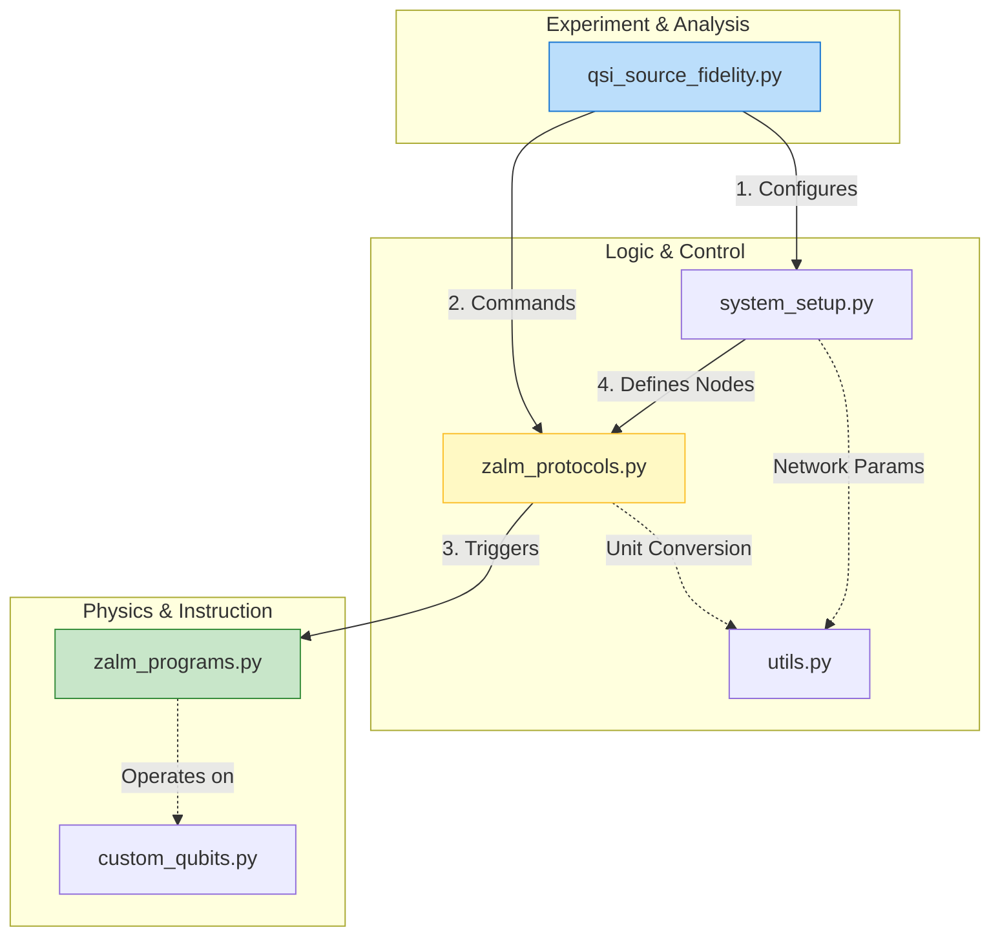

# zalm-source-simulation

```mermaid
graph TD
    %% Define Layers
    subgraph Application_Layer [Experiment & Analysis]
        Driver[qsi_source_fidelity.py]
    end

    subgraph Orchestration_Layer [Logic & Control]
        Setup[system_setup.py]
        Protocols[zalm_protocols.py]
        Utils[utils.py]
    end

    subgraph Quantum_Core_Layer [Physics & Instruction]
        Programs[zalm_programs.py]
        Qubits[custom_qubits.py]
    end

    %% Interactions
    Driver -->|1. Configures| Setup
    Driver -->|2. Commands| Protocols
    
    Protocols -->|3. Triggers| Programs
    Setup -->|4. Defines Nodes| Protocols
    
    Programs -.->|Operates on| Qubits
    Protocols -.->|Unit Conversion| Utils
    Setup -.->|Network Params| Utils

    %% Styling
    style Driver fill:#bbdefb,stroke:#1976d2
    style Protocols fill:#fff9c4,stroke:#fbc02d
    style Programs fill:#c8e6c9,stroke:#388e3c
```
